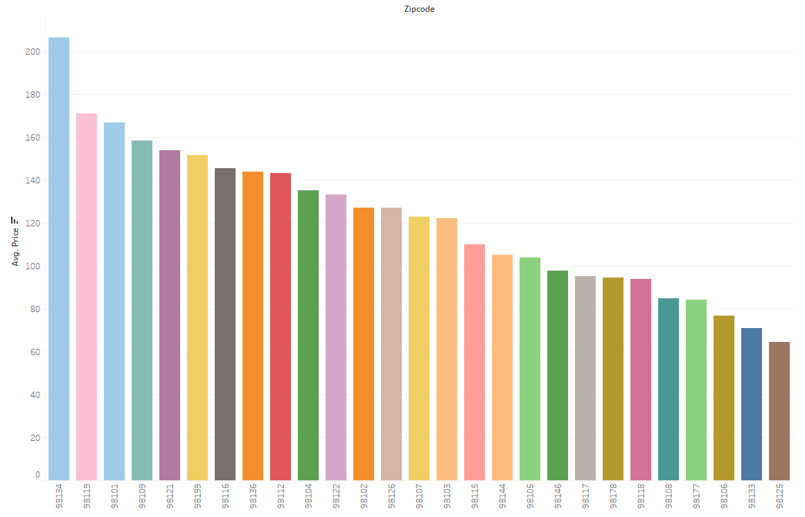
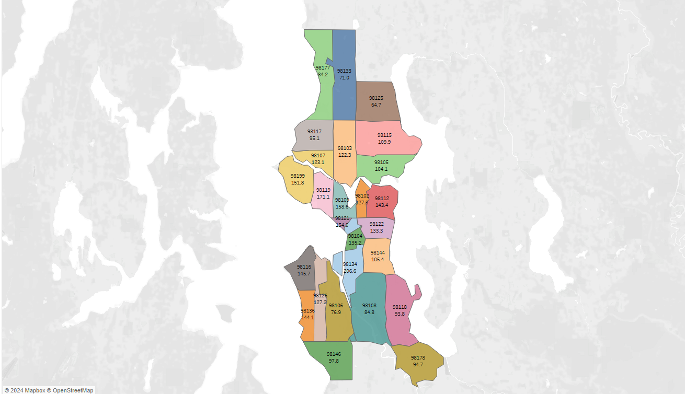
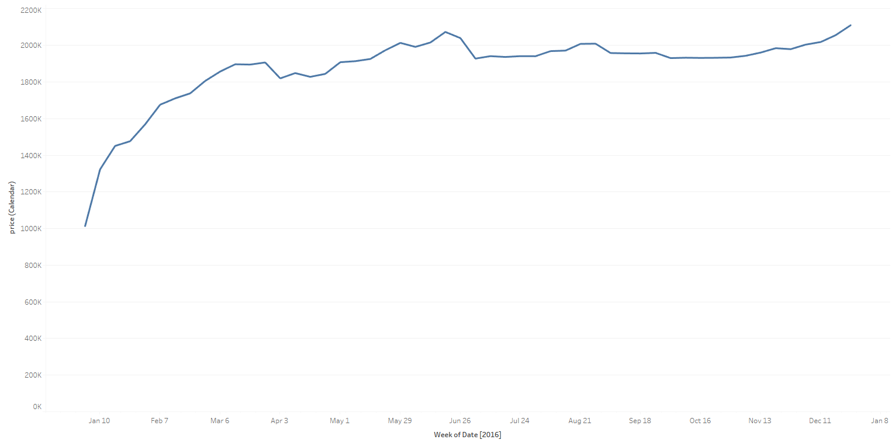
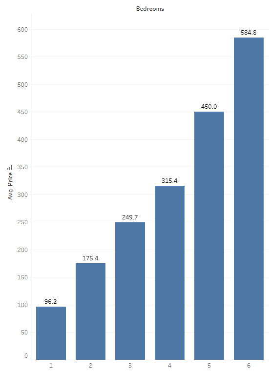
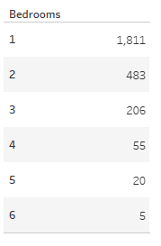
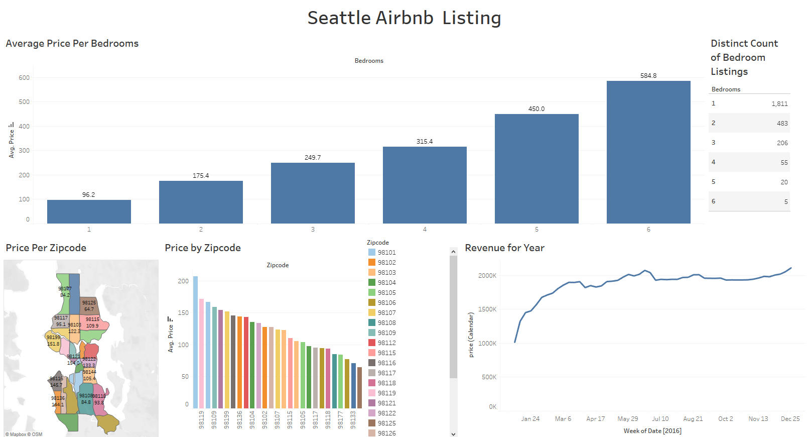

<!-- PROJECT TITLE -->
<h1 align="center">Seattle Airbnb Data Analysis Using Tableau</h1>

<!-- HEADER -->

  

<!-- PROJECT OVERVIEW -->
##  **➲ Project overview**
This project involves the analysis of Seattle Airbnb data using Tableau. The dataset, sourced from Kaggle, comprises three CSV files: Listings (full descriptions and average review scores), Reviews (unique IDs for reviewers and detailed comments), and Calendar (listing ID, price, and availability for each day).

<!-- PREREQUISTIES -->
##  **➲ Prerequisites**
This is list of required tools for the project to be installed :
* <a href="https://public-pantheon.tableau.com/en-us/s/download" target="_blank">Tableau Public</a>

<!-- THE DATASET -->
##  **➲ The Dataset**
The <a href="https://www.kaggle.com/datasets/airbnb/seattle" target="_blank">original dataset</a> includes the following files:
* Listings.csv: Contains full descriptions and average review scores.
* Reviews.csv: Includes unique IDs for each reviewer and detailed comments.
* Calendar.csv: Consists of listing IDs, prices, and availability for each day.  

but we comprise all togethr in single excel sheet can be found <a href="https://www.kaggle.com/datasets/alexanderfreberg/airbnb-listings-2016-dataset" target="_blank">here</a>.

<!-- DATA ANALYSIS -->
##  **➲ Data Analysis & Visualization**
In this part we create 5 visualizations get useful insights and then use these visualizations to create a dynamic dashboard where we analyze the following :  

* Average Price by Zipcode:
A bar plot displaying the average price for Airbnb listings in different zip codes.

* Average Price by Zipcode:
A map visualization illustrating the average price of Airbnb listings across different zip codes.

* Revenue for Year (Line Plot):
A line plot depicting the revenue generated over the year, providing insights into seasonal trends.

* Average Price per Number of Bedrooms:
A bar plot showing the average price of Airbnb listings based on the number of bedrooms.

* Distinct Count of Bedroom Listings:
A table presenting the distinct count of Airbnb listings based on the number of bedrooms.

* Dashboard:
An interactive dashboard that consolidates all the above visualizations, allowing users to gain comprehensive insights at a glance.

<!-- CONCLUSION -->
##  **➲ Conclusion**
This project provides a comprehensive analysis of Seattle Airbnb data, offering insights into pricing trends, revenue patterns, and the distribution of listings based on the number of bedrooms. The visualizations are designed to be intuitive and user-friendly, facilitating a deeper understanding of the dataset.

Feel free to explore and modify the Tableau workbook to derive additional insights or customize the visualizations based on specific areas of interest.

<!-- CONTACT -->
##  **➲ Contact**
- E-mail   : [omaarelsherif@gmail.com](mailto:omaarelsherif@gmail.com)
- LinkedIn : https://www.linkedin.com/in/omaarelsherif/
- Facebook : https://www.facebook.com/omaarelshereif
